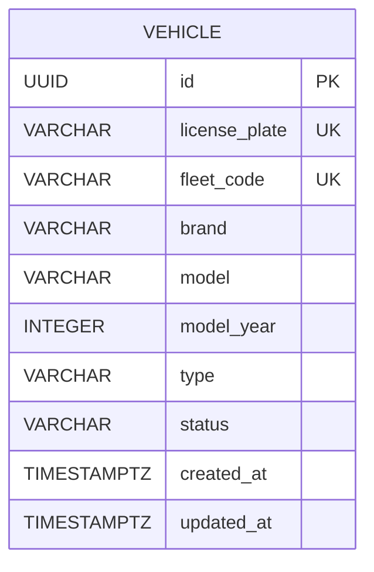

# Fleet Tracking data model

## Vehicle

`Vehicle` is the first domain entity in Fleet Tracking. It stores the identity, classification and operational status of a fleet vehicle. Position, speed and other telemetry data do not belong to this entity.

| Field | Java type | PostgreSQL type | Rules |
| --- | --- | --- | --- |
| `id` | `UUID` | `UUID` | Primary key generated by the application |
| `licensePlate` | `String` | `VARCHAR(7)` | Required and unique; stored uppercase without hyphens or spaces; accepts old Brazilian and Mercosul formats |
| `fleetCode` | `String` | `VARCHAR(50)` | Required and unique |
| `brand` | `String` | `VARCHAR(100)` | Required |
| `model` | `String` | `VARCHAR(100)` | Required |
| `modelYear` | `Integer` | `INTEGER` | Required; from 1900 through the year after the current year |
| `type` | `VehicleType` | `VARCHAR(20)` | Required; `TRUCK`, `VAN`, `CAR` or `MOTORCYCLE` |
| `status` | `VehicleStatus` | `VARCHAR(20)` | Required; starts as `ACTIVE`; may be `ACTIVE`, `INACTIVE` or `MAINTENANCE` |
| `createdAt` | `Instant` | `TIMESTAMP WITH TIME ZONE` | Required; assigned by the application when the vehicle is created |
| `updatedAt` | `Instant` | `TIMESTAMP WITH TIME ZONE` | Required; refreshed by the application when the vehicle changes |

Telemetry, Driver, Trip and Geofence are planned for future deliveries. They are not implemented entities in the current model.
